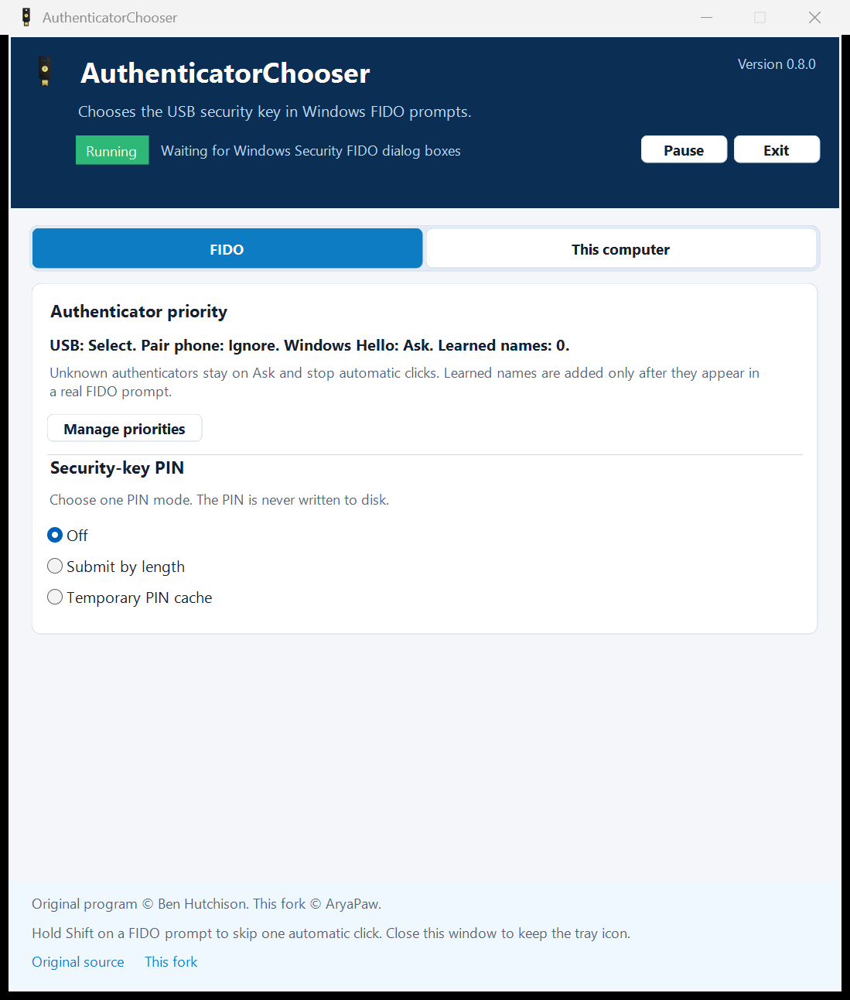

#  AuthenticatorChooser

[](https://github.com/AryaPaw/AuthenticatorChooser/actions/workflows/dotnet.yml)
[](https://github.com/AryaPaw/AuthenticatorChooser/releases/latest)
[](https://dotnet.microsoft.com/download/dotnet/8.0)
[](https://www.microsoft.com/windows)
[](LICENSE.txt)

Windows 11 asks “phone or security key?” every time you use a USB key. This program sits in the tray and clicks **Security key** for you. You can pause it, autostart it, rank other authenticators, and optionally handle the USB-key PIN by length or a temporary in-memory cache (never saved to disk).

<p align="center"></p>
<p align="center"></p>
<p align="center"></p>

## Local preview (this repo)

From the repo root, double-click `run-local.cmd` or:

```ps1
.\scripts\run-local.ps1
```

That stops the running tray process, publishes a single exe to `artifacts\local\AuthenticatorChooser.exe`, and opens the status window (`--show-window`). Use that folder as the local preview; do not dig through `bin\Release\net8.0-windows\win-x64\publish`.

`artifacts\` is gitignored build output:

- `artifacts\local\` — daily preview (this script)
- `artifacts\AuthenticatorChooser-Setup-*.exe` — installer from release-gate
- `artifacts\sandbox-in\` / `sandbox-out\` — Windows Sandbox checks, not for running the app

## Install

Needs **Windows 11** (22H2 Moment 4 or newer) and the [.NET 8 Desktop Runtime](https://dotnet.microsoft.com/en-us/download/dotnet/8.0/runtime). On Remote Desktop, run it on the **client** PC, not the remote one.

1. Download **AuthenticatorChooser-Setup-win-x64.exe** from [Releases](https://github.com/AryaPaw/AuthenticatorChooser/releases/latest) (or `win-arm64` on ARM PCs).
2. Run the setup (UAC). It puts the program in Program Files and adds a Start Menu shortcut.
3. It stays in the tray — double-click the key icon for the window. Leave **Start when I sign in** on if you want it after logon.

Uninstall from **Settings → Apps**. That stops the program and removes Program Files, the shortcut, the logon task, and `%AppData%\AuthenticatorChooser` (settings and logs).

Try it on [webauthn.io](https://webauthn.io) → **Authenticate**.

## Updates

Installed from Setup, it can download a newer installer from GitHub after you sign in to Windows and apply it in the background. If the PC is offline, it waits for a connection. Portable copies (no Setup) do not auto-update.

Turn this off with **Install updates silently from GitHub** in the status window.

## Using it

Closing the window does **not** quit; use **Exit**. A second launch opens the same window.

| | |
| --- | --- |
| **Pause** | Stops auto-clicks until you resume. Hold <kbd>Shift</kbd> to skip one click without pausing. |
| **Authenticator priority** | Ordered **Select / Ask / Ignore** rules. USB is Select by default; pairing a new phone is Ignore; Windows Hello is Ask. Unknown names (password-manager plugins, a paired phone’s own label, …) stay on Ask and **stop** automatic clicks. Names are learned only after they appear in a real FIDO prompt, never auto-preferred. Open **Manage priorities** to reorder, add, or restore defaults. Built-in rows cannot be renamed or removed. |
| **PIN: Off** | No PIN handling. |
| **PIN: Submit by length** | Type a PIN of the length you use → **Turn on**. Only the character count is kept. USB-key PIN only. |
| **PIN: Temporary PIN cache** | Enter the PIN twice, pick how long to remember it (1 / 2 / 5 / 10 minutes, or until lock or Exit), then **Cache PIN**. It is encrypted in this process with Windows `CryptProtectMemory` and is **never written to disk**. Lock, sleep, hibernate, Pause, Reset, a debugger, or Exit always forget it. Filling requires exactly one USB security key and a trusted Windows Security dialog (`CredentialUIBroker.exe` in System32, Microsoft-signed). If the PIN field comes back in the same prompt (likely a reject), the cache is cleared so a wrong PIN is not retried. |
| **Start when I sign in** | Starts with Windows. |
| **Install updates silently from GitHub** | Downloads and applies a newer Setup with no notifications. |

`--skip-all-non-security-key-options` and `--autosubmit-pin-length` still work as session overrides. Skip-all forces USB **Select** and treats other known options as **Ignore** for that process.

If it still highlights Security key but does not click Next, press <kbd>Enter</kbd>.

## Build from source

Install the [.NET SDK](https://dotnet.microsoft.com/en-us/download) 8 or later (or Visual Studio 2022/2026). Clone **this** repository, not an old upstream tag, if you want the tray UI.

```ps1
git clone https://github.com/AryaPaw/AuthenticatorChooser.git
cd AuthenticatorChooser
dotnet publish AuthenticatorChooser -c Release --runtime win-x64 --no-self-contained -p:PublishSingleFile=true
dotnet test /p:CollectCoverage=true
```

Output: `AuthenticatorChooser\bin\Release\net8.0-windows\win-x64\publish\AuthenticatorChooser.exe`. Installer script: `installer\AuthenticatorChooser.iss`.

CI (`.github/workflows/dotnet.yml`) publishes the same non-self-contained build. A GitHub Release with Setup and portable exes is created when you push a `v*` tag.

Unit tests cover settings migration, PIN cache policy, authenticator priority, title/caption mapping, autostart helpers, and the status window. UI Automation against live Windows Security dialogs is not part of CI.

## Related

### Creating new passkeys

When you try to create a passkey in your browser, the website may force it to be stored only in the TPM or only on a security key, rather than letting you freely choose between the two destinations. To override the site's mandate and put yourself back in control of where your new passkey will be saved, you can install [**Create Passkeys Anywhere**](https://github.com/Aldaviva/userscripts/raw/master/create-passkeys-anywhere/create-passkeys-anywhere.user.js) (requires [Tampermonkey](https://tampermonkey.net/) or a similar browser extension). It also works on Firefox for Android.

With this script installed, you will by default always be asked whether to save each new passkey on a security key or in the TPM. To change that, edit `options.allowedPasskeyCreationStorage` in the script: `securityKey` or `tpm` instead of `anywhere`.

## Stargazers over time

[](https://github.com/AryaPaw/AuthenticatorChooser/stargazers)

Original program © Ben Hutchison. This repository is an independent fork.
